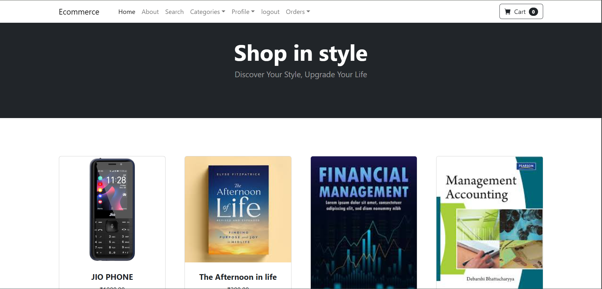
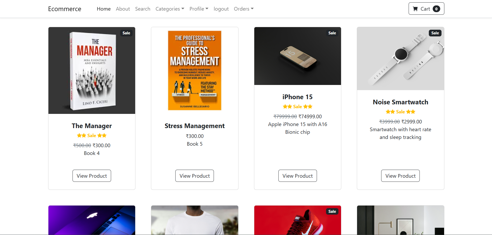
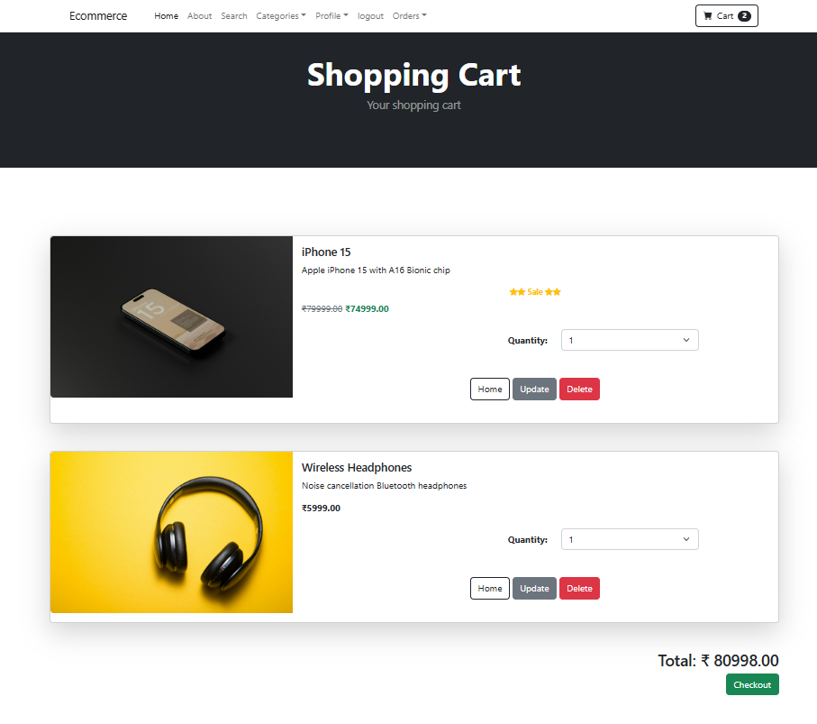
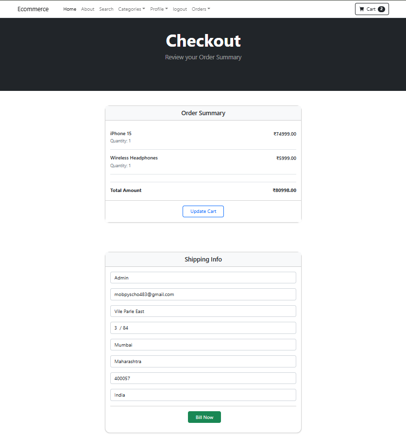
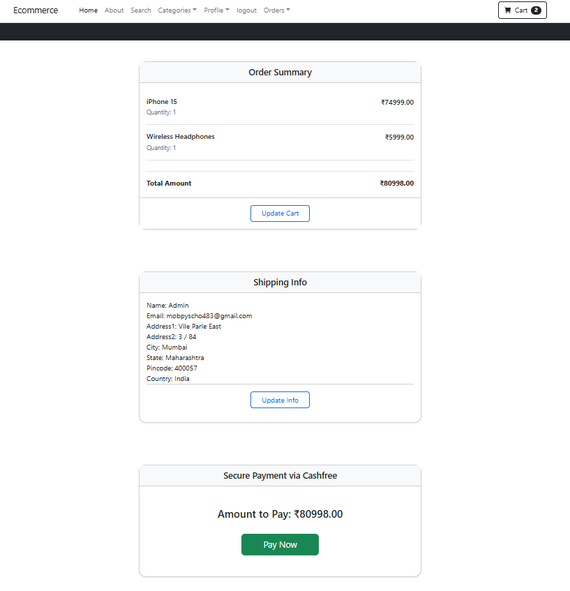
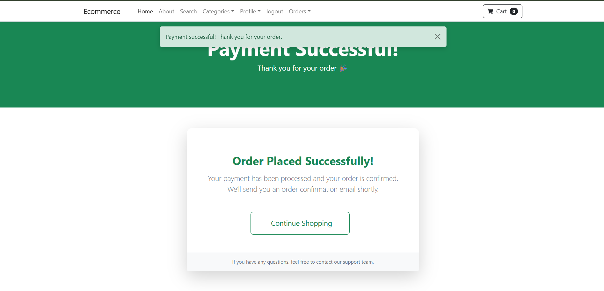

# Django E-Commerce Web App 🛒

A Django-based e-commerce application with Cashfree payment gateway integration.

## Features
- Product listing
- Cart & checkout
- Cashfree payment gateway (Sandbox)
- SQLite database
- Django 5.x

## Tech Stack
- Django
- SQLite
- Cashfree PG
- HTML / CSS / Bootstrap

## Screenshots

### Home Page



### Product Page


### Cart Page


### Checkout Page


### Summary Page


### Payment Page


## Setup Instructions

1. Clone repository
```bash
git clone https://github.com/GauravUmeshMalankar/DjangoEcommerceWebapp.git
Create virtual environment

2. Create Virtual Environment
python -m venv myenv
myenv\Scripts\activate
pip install -r requirements.txt

4. Create .env file
Put your Secret keys
DJANGO_SECRET_KEY=your-secret
CASHFREE_APP_ID=your-id
CASHFREE_SECRET_KEY=your-key

5. Run the following commands
python manage.py makemigrations
python manage.py migrate
python manage.py runserver


